[TOC]

---

**단어**

```
워크로드 ?
- 작업이 주는 스트레스의 양
- (컴퓨터) 시스템에 걸리는 작업량
- 시스템의 사용자 및 애플리케이션들이 발생시키는 전체 처리요구량

디스크 파티션 ?
- 디스크 파티션(disk partition) 작업은 하드 디스크 드라이브의 기억 공간을 "파티션"이라 알려진 별도의 데이터 영역으로 분할하는 것을 말한다. 
- 파티션 편집기(partition editor) 또는 파티셔닝 유틸리티(partitioning utility) 프로그램을 사용하여 이러한 파티션을 만들고 없애고 수정할 수 있다. 
- 한 번 디스크가 여러 개의 파티션으로 나뉘면 다른 카테고리의 디렉터리와 파일들은 다른 파티션에 저장된다. - 파티션이 많아질수록 제어권이 더 많아지지만 너무 많으면 다루기 쉽지 않게 된다. 
- 공간 관리, 접근 허가, 디렉터리 검색이 추가되는 방식은 파티션 상에 설치된 파일 시스템의 종류에 달려 있다. 
- 파티션 크기는 파티션에 설치된 파일 시스템에 따라 그 지원 능력이 달라지므로 파티션 크기를 조심스럽게 살피는 것이 필요하다.

디스크 볼륨 ?
- 하나의 파일 시스템을 갖춘 하나의 접근 가능한 스토리지 영역으로, 일반적으로(꼭 필수는 아니지만) 하드 디스크의 단일 파티션에 상주한다. 
- 볼륨이 물리 디스크 드라이브와 다를 수 있지만, 운영 체제의 논리 인터페이스로 접근할 수 있다. 그러나 볼륨은 파티션과는 차이가 있다.

파티션과 볼륨의 차이 ? -> https://ko.wikipedia.org/wiki/%EB%B3%BC%EB%A5%A8_(%EC%BB%B4%ED%93%A8%ED%8C%85)
볼륨은 파티션과는 다르다. 
이를테면, 플로피 디스크는 파티션이 포함되어 있지 않음에도 볼륨으로 접근이 가능한데, 
플로피 디스크는 현대의 대부분의 컴퓨터 소프트웨어를 가지고 파티셔닝이 불가능하다. 
또, 운영 체제는 이와 관련된 볼륨을 인식하지 않고도 파티션을 인식할 수 있지만, 
운영 체제가 그곳에 저장된 파일 시스템을 해석하지 못할 수 있다. 
이를테면 윈도우 NT 기반의 운영 체제들은 리눅스에 흔히 쓰이는 ext3 파일 시스템과 같이 마이크로소프트가 아닌 OS의 파티션이 포함된 디스크를 발견할 때 이러한 상황이 발생할 수 있다.

마운트 ?
마운트(mount)는 저장 장치에 접근할 수 있는 경로를 디렉터리 구조에 편입시키는 작업을 말한다. 
좁은 의미로는 유닉스 계열의 운영 체제에서의 mount 명령어 또는 그 명령어를 사용하는 것을 말한다. 
mount 명령어를 사용하면 저장 장치의 접근 경로를 원하는 위치에 생성할 수 있다. 
마운트를 이용하면 [분산 파일 시스템](https://ko.wikipedia.org/wiki/분산_파일_시스템)으로 확장하기가 용이하다. 
사용자는 마운트된 미디어의 파일들에만 접근이 가능하다.
- 하드디스크(또는 파티션)을 운영체제에 인식시켜서 사용자가 하드디스크에 접근할 수 있게 해 주는 것.
```

참고

```
https://ko.wikipedia.org/wiki/%EB%B3%BC%EB%A5%A8_(%EC%BB%B4%ED%93%A8%ED%8C%85)
https://bcho.tistory.com/1256?category=731548
```

---

## 용어 정리

#### 마스터와 노드

**들어가기전 클러스터의 구조를 알아야한다.**

> 클러스터(Cluster) : 밀접해 있는 다수의 무언가를 종칭

> [컴퓨터 클러스터?](https://ko.wikipedia.org/wiki/컴퓨터_클러스터)
>
> 여러대의 컴퓨터들이 연결되어 하나의 시스템처럼 동작하는 **컴퓨터들의 집합**
>
> 클러스터의 구성요소들은 일반적으로 고속의 근거리 통신망으로 연결된다.
>
> 서버로 사용되는 노드에는 **각각의 운영체제가 실행**된다.

- 클러스터 전체를 관리하는 컨트롤러로써 마스터가 존재한다.

- 컨테이너가 배포되는 머신(가상머신 혹은 물리서버머신)인 노드가 존재한다.

  > 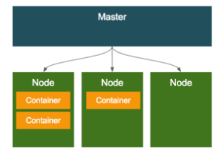

<br>

#### 오브젝트

- 가장 기본적인 구성단위가 되는 기본 오브젝트
- 이 기본 오브젝트를 생성하고 관리하는 추가적인 기능을 가진 컨트롤러

> 위의 두가지로 이루어진다.
>

##### 오브젝트 스펙 - 설정

오브젝트들은 모두 오브젝트의 특성(설정정보)을 기술한 오브젝트 스펙으로 정의가 되고,

커맨드 라인을 통해서 오브젝트 생성시 인자로 전달하여 정의하거나 yaml, json파일로 스펙을 정의할 수 있다.

##### 기본 오브젝트 - Pod, Service, Volume, NameSpace

쿠버네티스에 의해 배포/관리되는 가장 기본적인 오브젝트는 

컨테이너화되어 배포되는 애플리케이션의 워크로드를 기술하는 오브젝트로 

**Pod, Service, Volume, NameSpace** 4가지가 있다.

<br>

**각각 오브젝트들의 특징 !** 

##### Pod : 쿠버네티스에서 가장 기본적인 배포 단위 - 컨테이너를 포함하는 단위

> 쿠버네티스의 특징중 하나는 컨테이너를 개별적으로 하나씩 배포하는 것이 아니라, 
>
> <b style="color:red">Pod라는 단위로 배포</b>한다. Pod는 하나 이상의 컨테이너를 포함한다.
>
> **ex) Pod를 정의한 오브젝트 스펙 예시**
>
> ```
> apiVersion: v1
> kind: Pod
> 
> metadata:
> name: nginx
> 
> spec:
> containers:
>   - name: nginx
>  image: nginx:1.7.9
>  ports:
>     - containerPort: 8090
> ```
>
> - apiVersion은 이 스크립트를 실행하기 위한 쿠버네티스 API 버전이다 보통 v1을 사용한다.
>
> - kind 에는 리소스의 종류를 정의하는데, Pod를 정의하려고 하기 때문에, Pod라고 넣는다.
>
> - metadata에는 이 리소스의 각종 메타 데이타를 넣는데, 라벨(뒤에서 설명할)이나 리소스의 이름등 각종 메타데이타를 넣는다
>
> - spec 부분에 리소스에 대한 상세한 스펙을 정의한다.
>   - Pod는 컨테이너를 가지고 있기 때문에, container 를 정의한다. 이름은 nginx로 하고 도커 이미지 nginx:1.7.9 를 사용하고, 컨테이너 포트 8090을 오픈한다.

<br>

> **Pod 안에 한개 이상의 컨테이너를 가지고 있을 수 있다.**
>
> **왜! 개별적으로 하나씩 컨테이너를 배포하지 않고 여러개의 컨테이너를 Pod 단위로 묶어서 배포할까!?**
>
> - Pod내의 컨테이너는 IP와 Post를 공유한다.
>
>   > 두개의 컨테이너가 하나의 Pod를 통해서 배포되었을때, localhost를 통해서 통신이 가능하다.
>   >
>   > ex) 컨테이너 A가 8080, 컨테이너 B가 7001로 배포되었을 때
>   >
>   > B에서 A를 호출할 때는,  localhost:8080으로 호출, A에서 B를 호출할 때는,  localhost:7001으로 호출할 수 있다. 
>
> - Pod내에 배포된 컨테이너 간에는 디스크 볼륨을 공유할 수 있다.
>
>   > 근래 애플리케이션들은 실행할때 애플리케이션만 올라가는것이 아니라 Reverse proxy, 로그 수집기등 다양한 주변 솔루션이 같이 배포 되는 경우가 많고, 
>   >
>   > 특히 로그 수집기의 경우에는 애플리케이션 로그 파일을 읽어서 수집한다. 
>   >
>   > 애플리케이션 (Tomcat, node.js)와 로그 수집기를 다른 컨테이너로 배포할 경우, 
>   >
>   > 일반적인 경우에는 컨테이너에 의해서 파일 시스템이 분리되기 때문에, 
>   >
>   > 로그 수집기가 애플리케이션이 배포된 컨테이너의 로그파일을 읽는 것이 불가능 하지만, 
>   >
>   > 쿠버네티스의 경우 **하나의 Pod 내에서는 컨테이너들끼리 볼륨을 공유할 수 있기** 때문에 다른 컨테이너의 파일을 읽어올 수 있다.
>   >
>   > 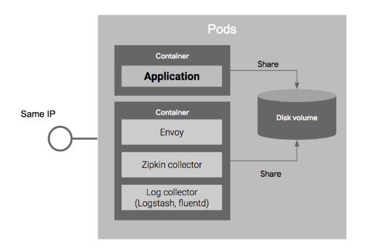
>   >
>   > 위와 같이 애플리케이션과 애플리케이션에서 사용하는 주변 프로그램을 같이 배포하는 패턴을 마이크로 서비스 아키텍쳐에서 사이드카 패턴(Side car pattern)이라고 하는데, 
>   >
>   > 이 외에도 Ambassador, Adapter Container 등 다양한 패턴이 있는데 => [참고](https://kubernetes.io/blog/2015/06/the-distributed-system-toolkit-patterns/)에서 ...

<br>

##### Volume

> Pod가 기동할때 디폴트로, 컨테이너마다 로컬 디스크를 생성해서 기동되는데, 이 로컬 디스크의 경우에는 영구적이지 못하다. 
>
> 즉 !  컨테이너가 리스타트 되거나 새로 배포될때 마다 로컬 디스크는 Pod 설정에 따라서 새롭게 정의되서 배포되기 때문에, 디스크에 기록된 내용이 유실된다. 
>
> 데이터베이스와 같이 영구적으로 파일을 저장해야 하는 경우에는 컨테이너 리스타트에 상관 없이 파일을 영속적으로 저장해야 하는데, 이러한 형태의 스토리지를 볼륨이라고 한다. 
>
> 볼륨은 <b style="color:red">컨테이너의 외장 디스크</b>로 생각하면 된다. Pod가 기동할때 컨테이너에 마운트해서 사용한다.
>
> 앞에서 언급한것과 같이 쿠버네티스의 볼륨은 Pod내의 컨테이너간의 공유가 가능하다.
>
> 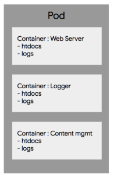
>
> **웹 서버를 배포하는 Pod**가 있을때, 
>
> 1. 웹서비스를 서비스하는 Web server 컨테이너
>
> 2. 로그 메세지를 관리하는 Logger라는 컨테이너
> 3. 컨텐츠의 내용 (/htdocs)를 업데이트하고 관리하는 Content mgmt 컨테이너
>
> 가 있다고 하자!
>
> - WebServer 컨테이너는 htdocs 디렉토리의 컨테이너를 서비스하고, /logs 디렉토리에 웹 억세스 기록을 기록한다. 
> - Logger 컨테이너는 logs 디렉토리의 로그를 수집한다.
> - Content 컨테이너는 htdocs 디렉토리의 컨텐트를 업데이트하고 관리한다.
>
> 이 경우 htdocs 컨텐츠 디렉토리는 WebServer와 Content 컨테이너가 공유해야 하고 logs 디렉토리는 Webserver 와 Logger 컨테이너가 공유해야 한다. 
>
> **이러한 시나리오에서 볼륨을 사용할 수 있다.**

>   아래와 같이 htdocs와 logs 볼륨을 각각 생성한 후에, htdocs는 WebServer와, Contents management 컨테이너에 마운트 해서 공유하고, logs볼륨은 Logger와 WebServer 컨테이너에서 공유하도록 하면된다.  
>
>   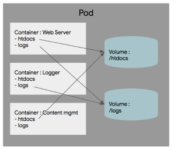
>
>   쿠버네티스는 다양한 외장 디스크를 추상화된 형태로 제공한다. 
>
>   iSCSI나 NFS와 같은 온프렘 기반의 일반적인 외장 스토리지 이외에도, 클라우드의 외장 스토리지인 AWS EBS, Google PD,에서 부터  github, glusterfs와 같은 다양한 오픈소스 기반의 외장 스토리지나 스토리지 서비스를 지원하여, 스토리지 아키텍처 설계에 다양한 옵션을 제공한다.

<br>

##### Service

> Pod와 볼륨을 이용하여, 컨테이너들을 정의한 후에, **Pod 를 서비스로 제공할때**, 일반적인 분산환경에서는 하나의 Pod로 서비스 하는 경우는 드물고, 
>
> **여러개의 Pod를 서비스하면서, 이를 로드밸런서를 이용해서 하나의 IP와 포트로 묶어서 서비스를 제공한다.**
>
> Pod의 경우에는 동적으로 생성이 되고, 장애가 생기면 자동으로 리스타트 되면서 그 IP가 바뀌기 때문에, 로드밸런서에서 Pod의 목록을 지정할 때는 IP주소를 이용하는 것은 어렵다. 
>
> 또한 오토 스케일링으로 인하여 Pod 가 동적으로 추가 또는 삭제되기 때문에, 이렇게 추가/삭제된 Pod 목록을 로드밸런서가 유연하게 선택해 줘야 한다. 
>
> 그래서 사용하는 것이 **라벨(label)**과 라벨 **셀렉터(label selector)** 라는 개념이다.
> **서비스를 정의할때, 어떤 Pod를 서비스로 묶을 것인지를 정의**하는데, 이를 **라벨 셀렉터**라고 한다. 
> 각 Pod를 생성할때 메타데이타 정보 부분에 **라벨**을 정의할 수 있다. 
>
> **서비스는 라벨 셀렉터에서 특정 라벨을 가지고 있는 Pod만 선택하여 서비스에 묶게 된다.**
>
> 아래 그림은 서비스가 라벨이 “myapp”인 서비스만 골라내서 서비스에 넣고, 
>
> 그 Pod간에만 로드밸런싱을 통하여 외부로 서비스를 제공하는 형태이다.
>
> 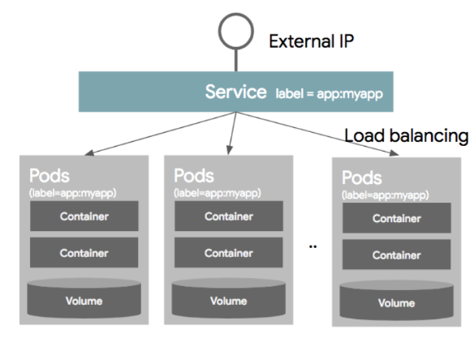
>
> ```spec
> kind: Service
> apiVersion: v1
> metadata:
> name: my-service
> spec:
> selector:
>  app: myapp
> ports:
> - protocol: TCP
>  port: 80
>  targetPort: 9376
> ```
>
> - 리소스 종류가 Service 이기 때문에, kind는 Service로 지정하고,
>
> - 스크립트를 실행할 api 버전은 v1으로 apiVersion에 정의했다.
>
> - 메타데이터에 서비스의 이름을 my-service로 지정하고
>
> - spec 부분에 서비스에 대한 스펙을 정의한다.
> - selector에서 라벨이 app:myapp인 Pod 만을 선택해서 서비스에서 서비스를 제공하게 하고
> - 포트는 TCP를 이용하되, 서비스는 80 포트로 서비스를 하되, 서비스의 80 포트의 요청을 컨테이너의 9376 포트로 연결해서 서비스를 제공한다. 

<br>

##### Name space

> 네임스페이스는 한 쿠버네티스 클러스터내의 논리적인 분리단위라고 보면 된다.
>
> Pod, Service 등은 네임 스페이스 별로 생성이나 관리가 될 수 있고, 
> 사용자의 권한 역시 이 네임 스페이스 별로 나눠서 부여할 수 있다.
>
> 즉 하나의 클러스터 내에, 개발/운영/테스트 환경이 있을때, 클러스터를 개발/운영/테스트 3개의 네임 스페이스로 나눠서 운영할 수 있다. 네임스페이스로 할 수 있는 것은
>
> -  사용자별로 네임스페이스별 접근 권한을 다르게 운영할 수 있다.
> -  네임스페이스별로 [리소스의 쿼타](https://kubernetes.io/docs/concepts/policy/resource-quotas/) (할당량)을 지정할 수 있다. 개발계에는 CPU 100, 운영계에는 CPU 400과 GPU 100개 식으로, 사용 가능한 리소스의 수를 지정할 수 있다. 
> - 네임 스페이스별로 리소스를 나눠서 관리할 수 있다. (Pod, Service 등)
>
> 주의할점은 네임 스페이스는 논리적인 분리 단위이지 물리적이나 기타 장치를 통해서 환경을 분리(Isolation)한것이 아니다. 다른 네임 스페이스간의 pod 라도 통신은 가능하다. 
>
> 물론 네트워크 정책을 이용하여, 네임 스페이스간의 통신을 막을 수 있지만 !
>
> <b style="color:red">높은 수준의 분리 정책을 원하는 경우에는 쿠버네티스 클러스터 자체를 분리하는 것을 권장</b>
>
> 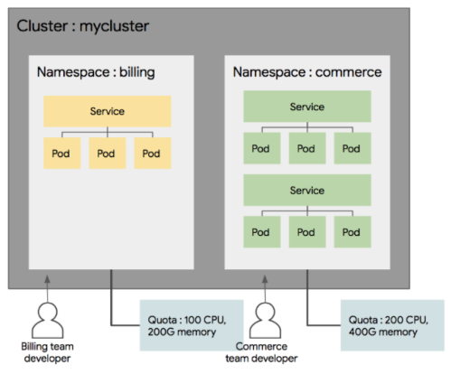

<br>

##### 라벨 - 쿠버네티스의 리소스를 선택하는데 사용이 된다.

> 각 리소스는 라벨을 가질 수 있고, 라벨 검색 조건에 따라서 특정 라벨을 가지고 있는 리소스만을 선택할 수 있다.
>
> 이렇게 라벨을 선택하여 특정 리소스만 배포하거나 업데이트할 수 있고 또는 라벨로 선택된 리소스만 Service에 연결하거나 특정 라벨로 선택된 리소스에만 네트워크 접근 권한을 부여하는 등의 행위를 할 수 있다. 
>
> 라벨은 metadata 섹션에 키/값 쌍으로 정의가 가능하며, 하나의 리소스에는 하나의 라벨이 아니라 여러 라벨을 동시에 적용할 수 있다.
>
> ```json
> "metadata": {
>   "labels": {
>     "key1" : "value1",
>     "key2" : "value2"
>   }
> }
> ```

> 셀렉터를 사용하는 방법은 오브젝트 스펙에서 selector 라고 정의하고 라벨 조건을 적어 놓으면 된다. 
>
> 쿠버네티스에서는 두 가지 셀렉터를 제공하는데, 
>
> 기본적으로 **1. Equaility based selector**와, **2. Set based selector** 가 있다.
>
> 1. **Equality based selector**
>
> - 같냐, 다르냐와 같은 조건을 이용하여, 리소스를 선택하는 방법으로
> - environment = dev
> - tier != frontend
>
> 식으로, 등가 조건에 따라서 리소스를 선택한다.
>
> <br>
>
> 이보다 향상된 셀렉터는 2. **set based selector**로, 집합의 개념을 사용한다.
>
> -  environment in (production,qa) 는 environment가 production 또는 qa 인 경우이고, 
> -  tier notin (frontend,backend)는 environment가 frontend도 아니고 backend도 아닌 리소스를 선택하는 방법이다.
>
> 다음 예제는 my-service 라는 이름의 서비스를 정의한것으로 셀렉터에서 app: myapp 정의해서 Pod의 라벨 app이 myapp 것만 골라서 이 서비스에 바인딩해서 9376 포트로 서비스 하는 예제이다.
>
> ```
> kind: Service
> apiVersion: v1
> metadata:
> name: my-service
> spec:
> selector:
>  app: myapp
> ports:
> - protocol: TCP
>  port: 80
>  targetPort: 9376
> ```

<br>

##### 컨트롤러 - 기본 오브젝트들을 생성하고 관리하는 역할

앞에서 소개한 4개의 기본 오브젝트로, 애플리케이션을 설정하고 배포하는 것이 가능한데 이를 조금 더 편리하게 관리하기 위해서 쿠버네티스는 컨트롤러라는 개념을 사용한다.

**컨트롤러는 기본 오브젝트들을 생성하고 이를 관리하는 역할**을 해준다. 

컨트롤러는 여러 개념을 갖고있다. 

- Replication Controller (aka RC)

  > ### Replication Controller
  >
  > Replication Controller는  Pod를 관리해주는 역할을 하는데, 지정된 숫자로 Pod를 기동 시키고, 관리하는 역할을 한다. 
  >
  > Replication Controller (이하 RC)는 3가지 파트로 구성된다.
  >
  > **1. Replica의 수, 2. Pod Selector, 3. Pod Template** 
  >
  > - **1.Replica 수** :  RC에 의해서 관리되는 Pod의 수인데, 그 숫자만큼 Pod 의 수를 유지하도록 한다. 예를 들어 replica 수가 3이면, 3개의 Pod만 띄우도록 하고, 이보다 Pod가 모자르면 새로운 Pod를 띄우고, 이보다 숫자가 많으면 남는 Pod를 삭제한다.
  > - **2.Selector** : 먼저 Pod selector는 라벨을 기반으로 하여,  RC가 관리한 Pod를 가지고 오는데 사용한다.
  > - **3.Pod**를 추가로 기동할 때 그러면 어떻게 Pod를 만들지 Pod에 대한 정보 (도커 이미지, 포트,라벨등)에 대한 정보가 필요한데, 이는 Pod template이라는 부분에 정의 한다.
  >
  > 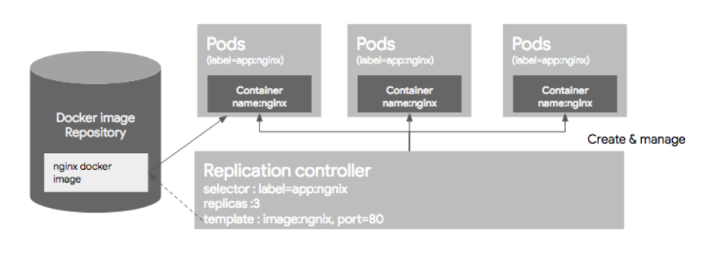
  >
  > 주의할점은 이미 돌고 있는 Pod가 있는 상태에서 RC 리소스를 생성하면 그 Pod의 라벨이 RC의 라벨과 일치하면 새롭게 생성된 RC의 컨트롤을 받는다. 
  >
  > 만약 해당 Pod들이 RC에서 정의한 replica 수 보다 많으면, replica 수에 맞게 추가분의 pod를 삭제하고, 모자르면 template에 정의된 Pod 정보에 따라서 새로운 Pod를 생성하는데, 기존에 생성되어 있는 Pod가 template에 정의된 스펙과 다를지라도 그 Pod를 삭제하지 않는다. 
  >
  > 예를 들어 기존에 아파치 웹서버로 기동중인 Pod가 있고, RC의 template은 nginx로 Pod를 실행하게 되어 있다하더라도 기존에 돌고 있는 아파치 웹서버 기반의 Pod를 삭제하지 않는다. 
  >
  > **ex) 예시**
  >
  > 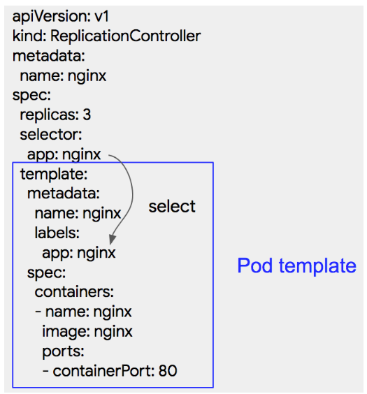
  >
  > 이 예제는 ngnix라는 이름의 RC를 정의한 것으로, label이 “app:ngnix”인 Pod들을 관리하고 3개의 Pod가 항상 운영되도록 설정한다.
  >
  > Pod는 app:ngix 라는 라벨을 가지면서 이름이 ngnix이고 nginx 이미지를 사용해서 생성하고 컨테이너의 포트는 80 번 포트를 이용해서 서비스를 제공한다.

- Replication Set

  > ReplicaSet은 Replication Controller 의 새버전으로 생각하면 된다.
  >
  > 큰 차이는 없고 Replication Controller 는 Equality 기반 Selector를 이용하는데 반해, 
  >
  > Replica Set은 Set 기반의 Selector를 이용한다. 

- DaemonSet

  > 클러스터 전체에 파드를 띄울때 사용하는 컨트롤러

  > 1. 데몬셋을 이용해서 파드를 실행하면 항상 그 파드가 클러스터 전체 노드에 떠 있게 된다.
  >
  >    데몬셋으로 파드를 실행하면 클러스터내에 새롭게 노드가 추가되었을때 자동으로 그 노드에 데몬셋으로 띄운 파드가 실행된다.
  >
  >    반대로 노드가 클러스터에서 빠졌을때는 그 노드에 있던 파드는 그대로 사라지고 다른 곳으로 옮겨가서 실행되거나 하지는 않는다. 
  >
  >    그렇기 때문에 데몬셋은 보통 로그수집기를 실행하거나 노드를 모니터링 하는 모니터링용 데몬등 클러스터 전체에 항상 실행시켜 두어야 하는 파드를 실행하는데 사용한다.
  >
  > 2. 데몬셋을 전체 클러스터의 노드가 아니라 특정 노드들에만 선택해서 실행할수도 있다. 
  >
  >    테인트(taint)와 톨러레이션(toleration) 옵션을 사용하면 그렇게 할 수 있다. 테인트가 지정된 노드에는 새로운 파드가 뜰수 없다. 
  >
  >    거기에 강제로 파드를 띄우기 위해서는 톨러레이션 옵션을 주면된다. (톨러레이션 옵션을 준 파드는 테인트가 있더라도 무시하고 실행됨)
  >
  > 2. 데몬셋을 업데이트하는 방법에는 2가지가 있다. 
  >
  >    .spec.updateStrategy.type에 옵션을 지정하면 되고 OnDelete, RollingUpdate 2가지중 하나를 선택할 수 있다. 
  >
  >    기본값은 OnDelete. OnDelete로 지정된 경우 데몬셋의 템플릿을 수정하더라도 바로 적용되지 않는다.
  >
  >     변경된 템플릿을 적용하려면 데몬셋으로 실행한 파드를 직접 지워야지 그 노드에 새로운 템플릿 버전의 파드가 실행된다. RollingUpdate 으로 지정하면 템플릿을 변경했을때 바로 변경사항이 반영된다. 하지만 이때 모든 포드가 한꺼번에 변경되는것이 아니라 지정된 개수 만큼 이전 포드를 내리고 새로운 포드를 실행하게 된다. 
  >
  >    이때 .spec.updateStrategy.rollingUpdate.maxUnavailable(기본값 1)와 .spec.minReadySeconds 옵션으로 한번에 교체되는 파드 개수를 조절할 수 있다.

- Job

  >   잡 컨트롤러는 계속해서 실행되어야하는 성격이 아니라 실행되고나서 종료되어야하는 성격의 작업을 실행시킬때 사용하는 컨트롤러. 
  >
  > 잡은 특정 개수 만큼의 파드가 성공적으로 완료되는걸 보장해준다. 
  >
  > 가장 간단한 경우로는 잡이 파드 하나를 실행하고 파드가 정상적으로 종료됐는지 확인하는 것. 
  >
  > 실행한 파드가 실패하거나 하드웨어 장애가 발생하거나 노드가 재부팅 되는등 문제가 발생하면 다시 파드를 실행한다. 잡 하나가 포드를 여러개 실행하는 것도 가능!!

- StatefulSet ([튜토리얼참고](https://kubernetes.io/ko/docs/tutorials/stateful-application/basic-stateful-set/))

  > 리플리카컨트롤러, 리플리케이션셋, 디플로이먼트는 모두 상태가 없는(stateless) 파드들을 관리하는 용도였다. 
  >
  > 스테이트풀셋(StatefulSets)은 단어의 의미 그대로 상태를 가지고 있는 파드들을 관리하는 컨트롤러. 
  >
  > 스테이트풀셋을 사용하면 볼륨을 사용해서 특정 데이터를 기록해두고 그걸 파드가 재시작했을때도 유지할 수 있다. 
  >
  > 여러개의 파드를 띄울때 파드 사이에 순서를 지정해서 지정된 순서대로 파드가  실행되게 할수도 있다. 이런식으로 어떠한 상태를 가지고 있어야 할때 사용하는게 스테이트풀 셋!!

- Deployment 

  > Deployment (이하 디플로이먼트) Replication controller와 Replica Set의 좀더 상위 추상화 개념이다. 
  >
  > 실제 운영에서는 ReplicaSet 이나 Replication Controller를 바로 사용하는 것보다, 좀 더 추상화된 Deployment를 사용하게 된다.
  >
  > #### 쿠버네티스 배포에 대한 이해
  >
  > 쿠버네티스의 Deployment 리소스를 이해하기 위해서는 쿠버네티스에서 Deployment 없이 어떻게 배포를 하는지에 대해서 이해를 하면 Deployment 를 이해할 수 있다. 
  >
  > <br>
  >
  > 다음과 같은 Pod와 RC가 있다고 하자
  >
  > 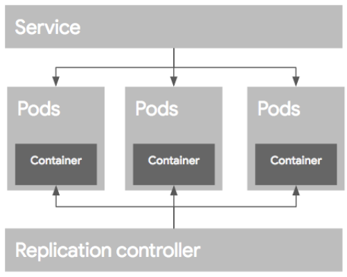
  >
  > 애플리케이션이 업데이트돼서 새로운 버전으로 컨테이너를 굽고 이 컨테이너를 배포하는 시나리오에 대해서 알아보자. 여러가지 배포 전략이 있겠지만, 2가지만 알아봄
  >
  > <br>
  >
  > 많이 사용하는 <b style="color:blue;">블루/그린 배포</b>와 <b style="color:green;">롤링 업데이트</b> 방식 두가지 방법에 대해서 설명한다.
  >
  > <b style="color:blue;">블루/그린 배포</b>
  >
  > 블루/그린 배포 방식은 블루(예전)버전으로 서비스 하고 있던 시스템을 그린(새로운)버전을 배포한 후, 
  >
  > 트래픽을 블루에서 그린으로 한번에 돌리는 방식이다.
  >
  > 여러가지 방법이 있지만 가장 손쉬운 방법으로는 새로운 RC을 만들어서 새로운 템플릿으로 Pod를 생성한 후에, Pod 생성이 끝나면, 서비스를 새로운 Pod로 옮기는 방식이다.
  >
  > 블루/그린 배포는 후에, 배포가 완료되고 문제가 없으면 예전 버전의 RC 와 Pod를 지워준다.
  >
  > 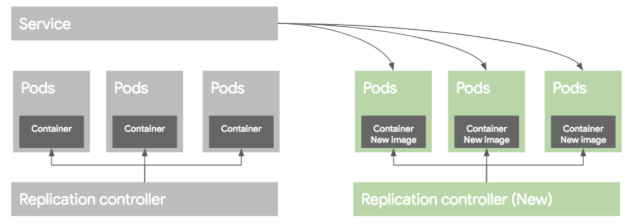
  >
  > <br>
  >
  > <b style="color:green;">롤링 업데이트</b>
  >
  > 롤링 업그레이드 방식은 Pod를 하나씩 업그레이드 해가는 방식이다. 
  >
  > 이렇게 배포를 하려면 먼저 새로운 RC를 만든후에, 기존 RC에서 replica 수를 하나 줄이고, 새로운 RC에는 replica 수를 하나만 준다.
  >
  > 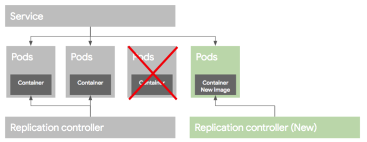
  >
  > 라벨을 같은 이름으로 해주면 서비스는 자연히 새로운 RC에 의해 생성된 Pod를 서비스에 포함 시킨다.
  >
  > 다음으로 기존 RC의 replica를 하나 더 줄이고, 새로운 RC의  replica를 하나 더 늘린다.
  >
  > 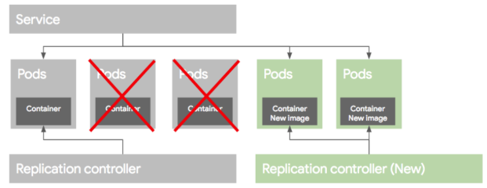
  >
  > 그러면 기존 버전의 Pod가 하나더 서비스에서 빠지게 되고 새로운 버전의 Pod가 서비스에 추가된다.
  >
  > 마찬가지 작업을 반복하게 되면, 아래 그림과 같이 예전 버전의 Pod가 모두 빠지고 새 버전의 Pod만 서비스 되게 된다. 
  >
  > 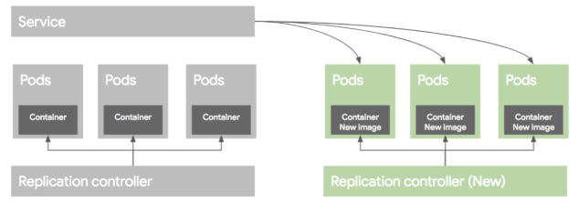
  >
  > 만약에 배포가 잘못되었을 경우에는 기존 RC의 replica 수를 원래대로 올리고, 새버전의 replica 수를 0으로 만들어서 예전 버전의 Pod로 롤백이 가능하다.
  >
  > 이 과정은 [kubectl rolling-update](https://kubernetes.io/docs/tasks/run-application/rolling-update-replication-controller/)라는 명령으로 RC 단위로 컨트롤이 가능하지만, 그래도 여전히 작업이 필요하고, 배포 과정을 모니터링 해야 한다. 그리고 가장 문제는 kubectl rolling-update 명령은 클라이언트에서 실행 하는 명령으로, 명령어 실행중에 클라이언트의 연결이 끊어 지면 배포작업이 비정상적으로 끊어질 수 있는 문제가 있다. 
  >
  > 그리고 마지막으로, 롤백과정 역시 수동 컨트롤이 필요할 수 있다.
  >
  > 그래서 이러한 과정을 자동화하고 추상화한 개념을 Deployment라고 보면 된다.
  >
  > Deployment는 Pod 배포를 위해서 RC를 생성하고 관리하는 역할을 하며, 특히 롤백을 위한 기존 버전의 RC 관리등 여러가지 기능을 포괄적으로 포함하고 있다. 
  >
  > 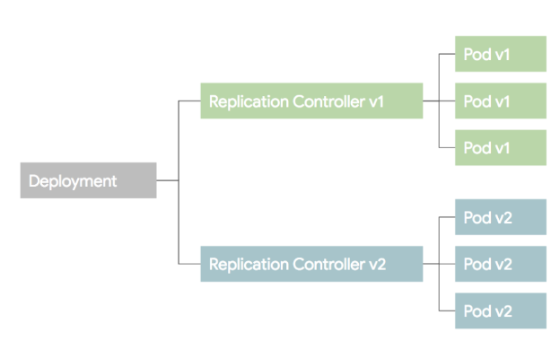
  >
  > 

