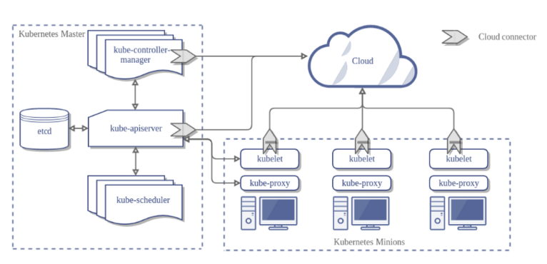

[TOC]

---

**단어**

```
에이전트(Agent) : 인터넷 상에서 정보를 수집하거나 다른 서비스를 수행하는 프로그램

프록시 : 클라이언트가 자신을 통해 다른 네트워크 서비스에 간접적으로 접속할 수 있게 해주는 시스템 혹은 응용 프로그램
- 서버와 클라이언트 사이에 중계기로서, 대리로 통신을 수행하는 것을 가리킴-! (중계기능)
- 프록시 서버 중 일부는 프록시 서버에 요청된 내용들을 캐시를 이용하여 저장해 둔다. 이렇게 캐시를 해 두고 난 후에, 캐시 안에 있는 정보를 요구하는 요청에 대해서는 원격 서버에 접속하여 데이터를 가져올 필요가 없게 됨으로써 전송 시간을 절약할 수 있게 됨과 동시에 불필요하게 외부와의 연결을 하지 않아도 된다는 장점을 갖게 된다. 또한 외부와의 트래픽을 줄이게 됨으로써 네트워크 병목 현상을 방지하는 효과도 얻을 수 있게 된다.

라우팅(routing) : 어떤 네트워크 안에서 통신 데이터를 보낼 최적의 경로를 선택하는 과정
```

참고

```
https://bcho.tistory.com/1258?category=731548
```

---

# [ 쿠버네티스 아키텍쳐 ]



# [ 마스터와 노드 ]

쿠버네티스는 크게 마스터(Master)와 노드(Node) 두 개의 컴포넌트로 분리된다.

- 마스터 : 쿠버네티스의 설정 환경을 저장하고 <b style="color:red">전체 클러스터를 관리</b>하는 역할 

- 노드 : 파드나 컨테이너 처럼 <b style="color:red">쿠버네티스 위에서 동작하는 워크로드를 호스팅</b>하는 역할

## :heavy_check_mark: 마스터

쿠버네티스 클러스터 전체를 컨트롤하는 시스템으로, 

**API 서버, etcd , 스케쥴러, 컨트롤러 매니져** 로 구성되어 있다.

### API 서버

<b style="color:red">쿠버네티스는 모든 명령과 통신을 API를 통해서</b> 하는데, 그 중심이 되는 서버가 API서버이다.

쿠버네티스의 모든 기능들을 REST API로 제공하고 그에 대한 명령을 처리한다.

<br>

### Etcd

API 서버가 명령을 주고 받는 서버라면, etcd는 쿠버네티스 클러스터의 데이터베이스 역할이 되는 서버로 <b style="color:red">설정값이나 클러스터의 상태를 저장하는 서버</b>이다.  

etcd라는 분산형 키/밸류 스토어 [오픈소스](https://github.com/coreos/etcd)로 쿠버네티스 클러스터의 상태나 설정 정보를 저장한다. 

<br>

### 스케쥴러

스케쥴러는<b style="color:red"> Pod, 서비스등 각 리소스들을 적절한 노드에 할당하는 역할</b>을 한다.

<br>

### 컨트롤러 매니져

컨트롤러 매니저는 <b style="color:red">컨트롤러(Replica controller, Service controller, Volume Controller, Node controller 등)를 생성하고 이를 각 노드에 배포하며 이를 관리하는 역할</b>을 한다.

<br>

### DNS

- <b style="color:red">쿠버네티스는 리소스의 엔드포인트(Endpoint)를 DNS로 맵핑하고 관리</b>한다. 

- Pod, 서비스 등은 IP를 배정받음 -> IP 주소가 계속 변경됨 -> 리소스에 대한 위치 정보가 필요함(Service Discovery  Pattern) -> DNS서버를 두는 방식으로 해결!

  >  Pod나 서비스등은 IP를 배정받는데, 동적으로 생성되는 리소스이기 때문에 그 IP 주소가 그때마다 변경이 되기 때문에, 그 리소스에 대한 위치 정보가 필요한데, 이러한 패턴을 Service discovery 패턴이라고 하는데, 쿠버네티스에서는 이를 내부 DNS서버를 두는 방식으로 해결하였다.

- 새로운 리소스가 생기면, 그 리소스에 대한 IP와 DNS 이름을 등록하여,  <b style="color:red">DNS 이름을 기반으로 리소스에 접근할 수 있도록</b> 한다.

<br>

---

## :heavy_check_mark: ​노드

노드는 마스터에 의해 명령을 받고 실제 워크로드를 생성하여 서비스 하는 컴포넌트이다.

노드에는 **Kubelet, Kube-proxy,cAdvisor, 컨테이너 런타임**이 배포된다.

### Kubelet

노드에 배포되는 에이전트로, <b style="color:red">마스터의 API서버와 통신</b>을 하면서, 노드가 수행해야 할 명령을 받아서 수행하고, 반대로 노드의 상태등을 마스터로 전달하는 역할을 한다. 

<br>

### Kube-proxy

<b style="color:red">노드로 들어오는 네트워크 트래픽을 적절한 컨테이너로 라우팅</b>하고, 

로드밸런싱등 노드로 들어오고 나가는 <b style="color:red">네트워크 트래픽을 프록시</b>하고, 

<b style="color:red">노드와 마스터간의 네트워크 통신을 관리</b>한다. 

<br>

### Container runtime (컨테이너 런타임)

<b style="color:red">Pod를 통해서 배포된 컨테이너를 실행하는 컨테이너 런타임</b>이다. 

컨테이너 런타임은 보통 **도커 컨테이너**를 생각하기 쉬운데, 도커 이외에도 rkt (보안이 강화된 컨테이너), Hyper container 등 다양한 런타임이 있다.

<br>

### cAdvisor

- cAdvisor는 각 노드에서 기동되는 모니터링 에이전트 

<b style="color:red">노드내에서 가동되는 컨테이너들의 상태와 성능등의 정보를 수집</b>하여, 

<b style="color:red">마스터 서버의 API 서버로 전달</b>한다.

이 데이터들은 주로 **모니터링을 위해서 사용**된다.

<br>

전체적인 구조 자체는 복잡하지 않다. 모듈화가 되어 있고, 기능 확장을 위해서 플러그인을 설치할 수 있는 구조로 되어 있다. 예를 들어 나중에 설명하겠지만 모니터링 정보를 저장하는 데이타베이스로는 많이 사용되는 Influx 데이타 베이스 또는 Prometheus 와 같은 데이타 베이스를 선택해서 설치할 수 있고 또는 커스텀 인터페이스 개발을 통해서, 알맞은 저장소를 개발하여 연결이 가능하다.


