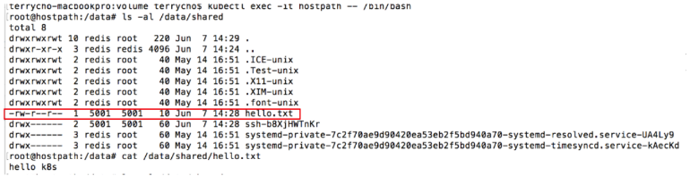

[TOC]

---

**단어**

```
리비전(revision) : 개정 프로세스
- 업데이트(소프트웨어나 데이터베이스 수정)을 의미함
- 리비전 제어(revision control) : 컴퓨터 파일 집합의 변경사항의 관리
```

**참고**

```
https://bcho.tistory.com/1259?category=731548
```

---

# 볼륨 ?

쿠버네티스에서 볼륨이란 **Pod에 종속되는 디스크**이다. (컨테이너 단위가 아님 ! )

<b style="color:red">Pod 단위</b>이기 때문에, 그 Pod에 속해 있는 여러개의 컨테이너가 공유해서 사용될 수 있다.

<br>

# 볼륨 종류

쿠버네티스의 볼륨은 여러가지 종류가 있는데,  

**[1] 로컬 디스크** 뿐 아니라, 

NFS, iSCSI, Fiber Channel과 같은 **[2] 일반적인 외장 디스크 인터페이스**는 물론, 

GlusterFS나, Ceph와 같은 **[3] 오픈 소스 파일 시스템**, 

AWS EBS, GCP Persistent 디스크와 같은 **[4] 퍼블릭 클라우드에서 제공되는 디스크**, 

VsphereVolume과 같이 **[5] 프라이빗 클라우드 솔루션에서 제공하는 디스크 볼륨**까지 

다양한 볼륨을 지원한다. ==> [자세한 볼륨 리스트 확인하기](https://kubernetes.io/docs/concepts/storage/volumes/#types-of-volumes)

<br>

이 **볼륨 타입을 구별**해보면 크게

<b style="color:blue">- 임시 디스크(Temp)</b>

<b style="color:blue">- 로컬 디스크(Local)</b> 

<b style="color:blue">- 네트워크 디스크(Network)</b> 

등으로 분류할 수 있다.

| Temp     | Local    | Network                                                      |
| -------- | -------- | ------------------------------------------------------------ |
| emptyDir | hostPath | GlusterFS<br />gitRepo<br />NFS<br />iSCSI<br />gcePersistentDisk<br />AWS EBS<br />azureDisk<br />Fiber Channel<br />Secret<br />VshereVolume |

위의 단어를 각각 알아보자,, !

<br>

## emptyDir

emptyDir은 Pod가 생성될때 생성되고, Pod가 삭제 될때 같이 삭제되는 **임시 볼륨**이다. 

단 Pod 내의 컨테이너 크래쉬되어 삭제되거나 재시작 되더라도 <b style="background-color:yellow">emptyDir의 생명주기는</b> 컨테이너 단위가 아니라, <b style="background-color:yellow">Pod 단위</b>이기 때문에, emptyDir은 삭제 되지 않고 계속해서 사용이 가능하다. 

생성 당시에는 디스크에 아무 내용이 없기 때문에, emptyDir  이라고 한다.

emptyDir의 물리적으로 노드에서 할당해주는 디스크에 저장이 되는데, (각 환경에 따라 다르다. 노드의 로컬 디스크가 될 수 도 있고, 네트워크 디스크등이 될 수 도 있다.) 

emptyDir.medium 필드에 “Memory”라고 지정해주면, emptyDir의 내용은 물리 디스크 대신 메모리에 저장이 된다.

다음은 하나의 **Pod에 nginx와 redis 컨테이너를 기동 시키고, emptyDir 볼륨을 생성하여 이를 공유하는 설정**이다.

```
apiVersion: v1
kind: Pod
metadata:
  name: shared-volumes 
spec:
  containers:
  - name: redis
    image: redis
    volumeMounts:
    - name: shared-storage
      mountPath: /data/shared
  - name: nginx
    image: nginx
    volumeMounts:
    - name: shared-storage
      mountPath: /data/shared
  volumes:
  - name : shared-storage
    emptyDir: {}
```

- shared-storage라는 이름으로 emptyDir 기반의 볼륨을 만든 후에, nginx와 redis 컨테이너의 /data/shared 디렉토리에 마운트를 하였다.

**ex) emptyDir 예시**

Pod를 기동 시킨후에, 

redis 컨테이너의 /data/shared 디렉토리에 들어가 보면 당연히 아무 파일도 없는 것을 확인할 수 있다. 

이 상태에서 file.txt 파일을 생성하였다. 

다음 nginx 컨테이너로 들어가서 /data/shared 디렉토리를 살펴보면 file.txt 파일이 있는 것을 확인할 수 있다. 

이 파일은 redis 컨테이너에서 생성이 되어 있지만, 같은 Pod 내이기 때문에, nginx 컨테이너에서도 접근이 가능하게 된다. 

<br>

## hostPath

다음은 hostPath 라는 볼륨 타입인데, hostPath는 <b style="background-color:yellow">노드의 로컬 디스크의 경로를 Pod에서 마운트해서 사용</b>한다. 

같은 hostPath에 있는 볼륨은 여러 Pod 사이에서 공유되어 사용된다. 

또한  Pod가 삭제 되더라도 hostPath에 있는 파일들은 삭제되지 않고 다른 Pod가 같은 hostPath를 마운트하게 되면, 남아 있는 파일을 액세스할 수 있다. 


주의할점 중의 하나는 Pod가 재시작되서 다른 노드에서 기동될 경우, 그 노드의 hostPath를 사용하기 때문에, 이전에 다른 노드에서 사용한 hostPath의 파일 내용은 액세스가 불가능하다. 

hostPath는 **노드의 파일 시스템을 접근하는데 유용**한데, 

예를 들어 노드의 로그 파일을 읽어서 수집하는 로그 에이전트를 Pod로 배포하였을 경우, 이 Pod에서 노드의 파일 시스템을 접근해야 한다. 이러한 경우에 유용하게 사용할 수 있다. 

아래는 노드의 /tmp 디렉토리를 hostPath를 이용하여 /data/shared 디렉토리에 마운트 하여 사용하는 예제이다.

```
apiVersion: v1
kind: Pod
metadata:
  name: hostpath
spec:
  containers:
  - name: redis
    image: redis
    volumeMounts:
    - name: terrypath
      mountPath: /data/shared
  volumes:
  - name : terrypath
    hostPath:
      path: /tmp
      type: Directory
```

이 Pod를 배포해서 Pod를 Id를 얻기


Pod Id를 통해 VM 확인


VM에 SSH로 접속해서 /tmp/에 hello.txt 파일 생성


Pod의 컨테이너에서 마운트된 /data/shared 디렉토리를 확인해보면 노드의 /tmp 디렉토리의 내용이 그대로 보임



<br>

## gitRepo

볼륨 타입중에 gitRepo는 유용한 볼륨 타입이다.

이 볼륨은 생성시에 지정된 git 리파지토리의 특정 리비전의 내용을 clone을 이용해서 내려 받은후에 디스크 볼륨을 생성하는 방식이다. 물리적으로는 emptyDir이 생성되고, git 레파지토리 내용을 clone으로 다운 받는다.


HTML과 같은 정적 파일이나 Ruby on rails, PHP, node.js 와 같은 스크립트 언어 기반의 코드들은 gitRepo 볼륨을 이용하여 손쉽게 배포할 수 있다.

```
apiVersion: v1
kind: Pod
metadata:
 name: gitrepo-volume-pod
spec:
 containers:
 - image: nginx:alpine
   name: web-server
   volumeMounts:
   - name: html
     mountPath: /usr/share/nginx/html
     readOnly: true
   ports:
   - containerPort: 80
     protocol: TCP
 volumes:
 - name: html
   gitRepo:
        repository: https://github.com/luksa/kubia-website-example.git
        revision: master
        directory: .
```

이 설정은 https://github.com/luksa/kubia-website-example.git 의 master 리비전을 클론으로 다운받아서 /usr/share/nginx/html에 마운트 시키는 설정

